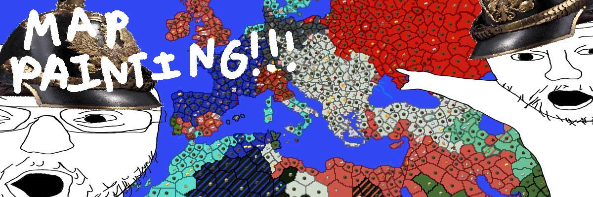

# Minecraft nodes plugin

Map painting but in block game. Contains server plugin located in build/libs/nodes-0.0.14-reobf.jar
Warzone system is in portuguese, made that for a friend.

**Documentation:** <https://nodes.soy>  
**Test editor:** <https://editor.nodes.soy/earth.html>  


# Repo structure
```
 ┌─ build/                - Contains main server plugin
 ├─ gradle/               - Gradle stuff, no need to change anything here
 └─ src/                  - Source code for the plugin
```


# Build
This repository only contains the main server plugin source.

## 1. Building main server plugin
Requirements:
- Java JDK 21 (current plugin target java version)

**This build example will be for version 1.21.4+, currently
the only supported versions.** 

### 1. Build server plugin `nodes-0.0.14-reobf.jar`:
Go inside root project folder and run
```
./gradlew build
```
Built `nodes-0.0.14-reobf.jar` will appear in `build/libs/nodes-0.0.14-reobf.jar`.


# License
Licensed under [GNU GPLv3](https://www.gnu.org/licenses/gpl-3.0.en.html).
See [LICENSE.md](./LICENSE.md).


# Acknowledgements
Special thanks to early contributors:
- **Jonathan**: coding + map painting
- **Doneions**: coding + testing + lole
- **phonon**: original plugin
